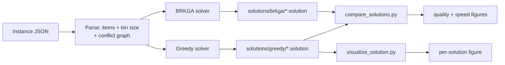
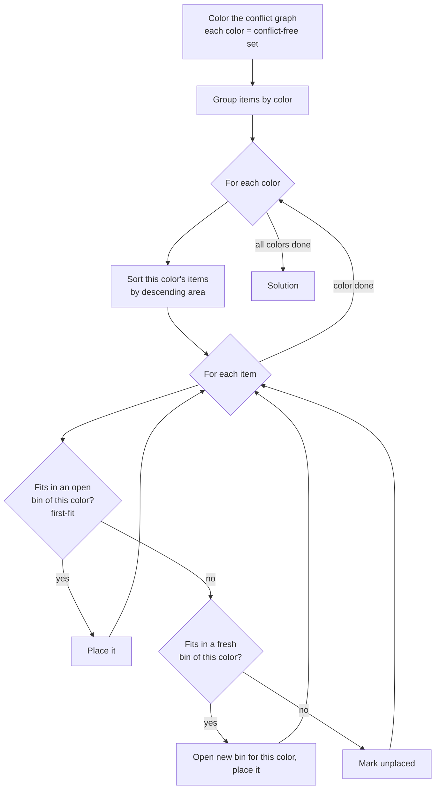
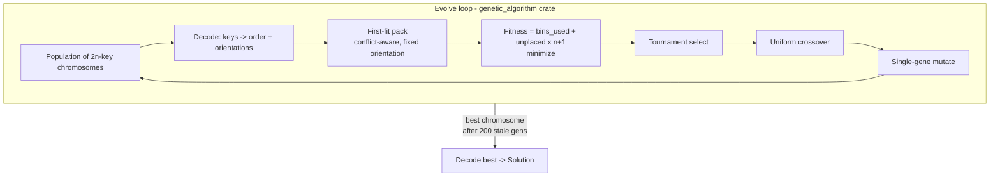

# SPU2D Bin Conflicts

**2D Bin Packing with Conflicts** — pack a set of rectangular items into the
fewest fixed-size bins, where some pairs of items are *in conflict* and may not
share a bin. Items may be rotated 90°. The problem generalizes classic 2D bin
packing and is NP-hard.

The project ships two solvers and compares them:

- a **greedy** first-fit-decreasing baseline, and
- a **BRKGA** (biased random-key genetic algorithm) metaheuristic.

Both share the same conflict-aware geometric placement engine, so the comparison
isolates the *search strategy* from the packing mechanics.

---

## Requirements

- **Rust** (edition 2024 — toolchain 1.85+; developed with 1.95). Install via
  [rustup](https://rustup.rs/).
- **Python 3** with `matplotlib` and `numpy`, only for the helper scripts under
  `scripts/` (visualization, comparison, instance generation).

---

## Running it

Build and run the solver binary. Its single optional argument is a directory; it
recursively finds every `*.json` instance under it, runs **both** solvers on
each, and writes one `.solution` file per solver.

```bash
# Solve the default instance set (instances_conflict/OPP/CJCM08):
cargo run --release

# Solve a specific directory of instances:
cargo run --release -- instances_conflict/OPP/BPP-Subproblems
```

Per instance it prints a one-line summary and writes:

```
solutions/greedy/<instance>.solution
solutions/brkga/<instance>.solution
```

A `.solution` is JSON: bin dimensions, item count, bins used, the list of
unplaced items, runtime, and per-bin item placements (`index`, `x`, `y`,
`width`, `height`, `rotated`). The instance name and the method are **not**
stored inside — they come from the file stem and the parent directory.

### Tests

```bash
cargo test
```

### Helper scripts

```bash
# Generate conflict variants (densities 0.1/0.3/0.5) of every instance
# under instances/ into instances_conflict/:
python3 scripts/gen_conflict_instances.py

# Visualize one solution: bins + the instance's conflict graph + used items.
# The conflict graph lives in the instance JSON, auto-located by file stem:
python3 scripts/visualize_solution.py solutions/greedy/E00N10_c0.1.solution

# Compare greedy vs BRKGA across all solutions (quality + speed figures):
python3 scripts/compare_solutions.py
```

---

## Project layout

| Path | Role |
|------|------|
| `src/main.rs` | Entry point: discover instances, run both solvers, serialize. |
| `src/instance.rs` | Parse instance JSON (two schemas) into items + conflict graph. |
| `src/item.rs`, `src/ems.rs` | Item, point, and empty-maximal-space rectangle types. |
| `src/conflict_graph.rs` | Adjacency-based conflict graph keyed by item index. |
| `src/coloring.rs` | Greedy (Welsh-Powell) coloring of the conflict graph into conflict-free classes. |
| `src/container.rs` | One bin: EMS-based placement engine, conflict-aware insert. |
| `src/greedy.rs` | Greedy solver: color the conflict graph, then first-fit-decreasing per color. |
| `src/encoder.rs` | BRKGA random-key genotype + chromosome interpretation. |
| `src/decoder.rs` | BRKGA decoder, fitness, and the Evolve run. |
| `src/serializer.rs` | `.solution` JSON output. |
| `instances/`, `instances_conflict/` | Source instances and their conflict variants. |
| `solutions/` | Generated `.solution` files and comparison figures. |
| `scripts/` | Python tooling (generate / visualize / compare). |

---

## How the solvers work

### Overall pipeline



Both solvers produce the same `Solution` type (a list of bins plus any unplaced
items), so they share one serializer and one set of analysis scripts.

### Shared placement engine (`Container`)

Each bin is a `Container` that tracks its free area as a set of **Empty Maximal
Spaces (EMS)** — maximal free rectangles. Inserting an item:

1. **Conflict check** — reject if the item conflicts with anything already in the
   bin (`ConflictGraph::neighbors`).
2. **Fit + bottom-left** — among EMS the item fits in, choose the lowest origin
   (smallest `y`, then `x`).
3. **Split & prune** — carve the occupied rectangle out of overlapping EMS and
   drop non-maximal/degenerate ones.

The greedy solver uses `try_insert` (auto-rotates to whichever orientation fits);
the BRKGA decoder uses `try_insert_oriented` (orientation is fixed by the
chromosome).

### Greedy (coloring + first-fit-decreasing)

The greedy first **colors the conflict graph** (`src/coloring.rs`,
greedy/Welsh-Powell): conflicting items always get different colors, so each
**color class is a conflict-free set**. Items are then packed **per color** —
every color gets its own dedicated bins (no bin ever mixes colors), so conflicts
are impossible by construction. Within a color, items are placed
first-fit-decreasing, opening **another bin for that color** when its items
overflow.



Deterministic and fast: color the graph, then for each color pack its items
largest-first into bins reserved for that color, opening a new bin only when none
accepts the item. It is the baseline the metaheuristic is measured against.

### BRKGA (biased random-key genetic algorithm)

The encoding decouples *search* from *packing*. A chromosome is `2n` random keys
in `[0, 1]`:

- keys `0..n` → **insertion order** (items sorted by ascending key),
- keys `n..2n` → **orientation** (`≥ 0.5` ⇒ rotated 90°).



The decoder packs items in chromosome order using the shared first-fit engine.
Fitness minimizes bins used, with each unplaced item penalized by more than any
feasible packing could cost (`n + 1`), so feasibility always dominates bin count.
Evolution runs with a population of 100, tournament selection, uniform crossover,
single-gene mutation, and a fixed RNG seed (reproducible), stopping after 200
generations without improvement; the best chromosome is decoded into the final
packing.
